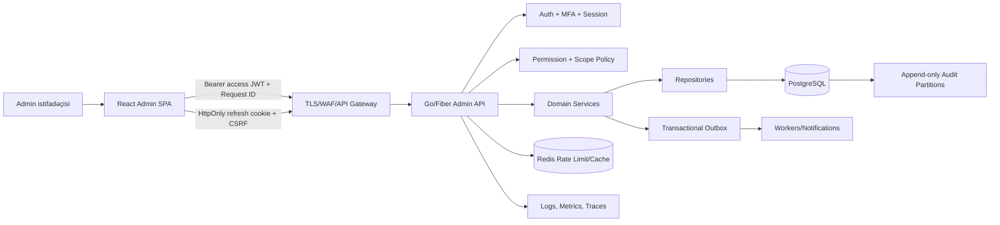

# GEN Z Club Admin Panel — Master İnkişaf Planı və Memarlıq Sənədi

> **Status:** İcraya hazır texniki spesifikasiya  
> **Əhatə:** `admin/` React Admin frontend + `backend/` Go/Fiber/PostgreSQL inteqrasiyası  
> **Versiya:** 1.0  
> **Tarix:** 16 avqust 2026  
> **Əsas prinsip:** UI icazəni yalnız əks etdirir; səlahiyyət barədə son qərarı həmişə backend verir.

---

## 0. Sənədin məqsədi və qərar xülasəsi

Bu sənəd mövcud mobil API-ni pozmadan ayrıca, təhlükəsiz və genişlənə bilən inzibatçı səthinin sıfırdan production-a qədər qurulması üçün texniki müqavilədir. Hədəf yalnız CRUD ekranları deyil; rollara və resurs scope-larına bağlı server-side authorization, təhlükəsiz browser sessiyası, dəyişikliklərin izah edilə bilən audit izi, dayanıqlı API kontraktı və ardıcıl idarəetmə UX-i yaratmaqdır.

Əsas qərarlar:

1. Admin API mövcud `/api/v1` daxilində, ayrıca `/api/v1/admin` namespace-ində qurulur. Mövcud mobil endpoint-lər dəyişdirilmir.
2. Rol adı endpoint daxilində əl ilə yoxlanmır. `permission + resource scope + object ownership + action context` modeli tətbiq olunur.
3. Access JWT qısaömürlü və yalnız memory-də saxlanılır. Admin refresh credential-i `Secure`, `HttpOnly`, `SameSite=Strict` cookie-də saxlanılır; `localStorage`/`sessionStorage`-da token saxlanmır.
4. Client-dən gələn `X-Role`, `role`, `user_id`, `club_id` kimi dəyərlər authorization sübutu deyil. Server aktyoru access token/session-dan, rolları DB-dən, scope-u isə DB əlaqələrindən çıxarır.
5. React Admin üçün config-driven custom `dataProvider`, `authProvider` və capability-driven menyu/route guard qurulur.
6. Yazma əməliyyatları audit event-i ilə eyni transaction-da tamamlanır. Kritik əməliyyatlar step-up authentication, səbəb və idempotency tələb edir.
7. Silmə default olaraq soft-delete/archive-dir. Hard delete yalnız hüquqi retention siyasəti və Superadmin step-up axını ilə mümkündür.
8. Maliyyə məlumatı ayrıca permission ailəsidir: Admin roluna verilməyəcək; Ambassador yalnız öz hesablanmış nəticəsini, Superadmin isə ümumi maliyyəni görə bilər.

### 0.1 Uğur göstəriciləri

| Sahə | Production hədəfi |
|---|---|
| Authorization | Qorunan endpoint-lərin 100%-i deny-by-default permission middleware və object-scope yoxlamasından keçir |
| Audit | Kritik yazmaların 100%-i actor, action, target, before/after diff, request ID və nəticə ilə izlənir |
| Sessiya | Access TTL 5–10 dəqiqə; refresh rotation və reuse detection; role/status dəyişikliyi dərhal qüvvəyə minir |
| Performans | Dashboard p95 < 2.5 s, list API p95 < 500 ms, mutation p95 < 800 ms (normal yükdə) |
| Etibarlılıq | Admin API availability hədəfi ≥ 99.9%; 5xx nisbəti < 0.5% |
| UX | WCAG 2.2 AA, keyboard navigation, bütün list/detail səhifələrində loading/error/empty/success state |
| Keyfiyyət | Kritik permission cütləri və P0/P1 user flow-ları üçün avtomat test; buraxılışda 0 açıq critical/high security finding |

---

## 1. Mövcud vəziyyətin repo auditi

### 1.1 `admin/` — hazırkı vəziyyət

- React 19, TypeScript, Vite 8 və `react-admin@5.15.1` quraşdırılıb.
- `src/App.tsx` hələ Vite starter ekranıdır; provider, resource, auth, theme və test infrastrukturu yoxdur.
- `react-admin` vasitəsilə MUI və TanStack Query dependency-ləri mövcuddur, lakin app arxitekturası qurulmayıb.
- TypeScript `noUnusedLocals`/`noUnusedParameters` aktivdir; type-aware lint, test və E2E script-ləri əlavə edilməlidir.

### 1.2 `backend/` — istifadə ediləcək mövcud imkanlar

- Go/Fiber tətbiqi `handler → service → repository → PostgreSQL` qatlarına bölünüb.
- Standart uğur zərfi `{ data, request_id }`, xəta zərfi `{ code, message, request_id, details? }` mövcuddur.
- Access və refresh JWT üçün ayrı secret-lər, refresh hash-in DB-də saxlanması, rotation, session revocation və `last_seen_at` mövcuddur.
- Access token `uid`, `sid`, `typ` daşıyır. `RequireAuth` session aktivliyini DB-də yoxlayır.
- Rollar `roles/user_roles` cədvəllərindən sorğu zamanı oxunur. Seed-də `user`, `ambassador`, `moderator`, `admin`, `superadmin` var.
- `RequireAnyRole` yalnız ilkin rol yoxlamasıdır. Tam permission kataloqu və ümumi object-level policy engine yoxdur.
- Clubs, events, attendees, join requests, tickets, payments, ambassador profiles/tasks/referrals və digər baza cədvəlləri mövcuddur.
- Event join-request və check-in üçün `CanManageEvent` tipli ownership yoxlamaları var; bu pattern admin modullarına ümumiləşdirilməlidir.
- CORS, request ID, əsas security header-ləri və in-memory rate limiter mövcuddur.

### 1.3 İcradan əvvəl bağlanmalı boşluqlar

| Boşluq | Risk | Həll istiqaməti |
|---|---|---|
| Admin CRUD/list endpoint-ləri yoxdur | Panel mobil endpoint-ləri səhv məqsədlə istifadə edər | Ayrı `/api/v1/admin` contract |
| Permission kataloqu yoxdur | Rol check-ləri dağınıq və səhvə açıq olar | `permissions`, `role_permissions`, `RequirePermission` |
| Admin login konteksti rolları/capability-ləri qaytarmır | Menyu və route-lar etibarlı qurulmaz | `/admin/auth/context` və permission version |
| 2FA/WebAuthn yoxdur | Privileged account takeover riski | Admin üçün məcburi MFA, recovery və step-up |
| Audit log yoxdur | Dəyişikliklərin müəllifi və səbəbi sübut edilə bilməz | Append-only audit + security events |
| Refresh token JSON body-də qaytarılır | Browser token oğurluğu/XSS təsiri böyüyür | Admin üçün HttpOnly cookie BFF-style auth contract |
| Mövcud refresh JWT-də unikal `jti` yoxdur | Eyni saniyədə yaradılan token eyni ola, rotation zəifləyə bilər | Təsadüfi `jti` və ya opaque refresh token |
| Access JWT-də `iss/aud/jti` yoxdur | Token başqa consumer/səthdə qəbul edilə və revoke/trace zəifləyə bilər | Admin audience, issuer, random JTI və key ID yoxlaması |
| Rate limit in-memory-dir | Multi-instance deployment-da bypass olunur | Redis/API gateway shared limiter |
| CORS default `*` ola bilir | Production misconfiguration | Startup-da production allowlist validation |
| Upload qovluğu public static-dir | Media authorization və content riskləri | Private object storage, signed URL, AV/decode validation |
| Optimistic concurrency yoxdur | İki operatorun dəyişiklikləri itə bilər | `version`, `updated_at`, `ETag/If-Match`, `409` |
| Auditlə mutation atomik deyil | Uğurlu dəyişiklik auditsiz qala bilər | Eyni DB transaction və ya transactional outbox |

---

# BÖLMƏ A — Arxitektura və Backend inteqrasiyası

## 2. Hədəf sistem arxitekturası



### 2.1 Trust boundary-lər

- **Browser etibarsızdır:** route guard, gizli düymə və `X-Active-Role` təhlükəsizlik sərhədi deyil.
- **Gateway ilk sərhəddir:** TLS, HSTS, request ölçüsü, IP/device risk siqnalları və distributed rate limiting.
- **API əsas authorization sərhədidir:** session, account status, MFA assurance, permission və object scope burada yoxlanır.
- **DB invariant sərhədidir:** FK, CHECK, UNIQUE, version, state transition və audit immutability constraint-lərlə qorunur.
- **Worker ayrıca principal-dır:** istifadəçi tokeni ilə deyil, dar service identity ilə işləyir.

## 3. Təklif olunan kod strukturu

### 3.1 Frontend — `admin/src`

```text
src/
├── app/
│   ├── AdminApp.tsx
│   ├── queryClient.ts
│   ├── routes.tsx
│   └── runtimeConfig.ts
├── auth/
│   ├── authProvider.ts
│   ├── tokenStore.ts          # memory-only access token
│   ├── refreshCoordinator.ts  # single-flight refresh
│   ├── permissions.ts
│   └── StepUpDialog.tsx
├── data/
│   ├── httpClient.ts
│   ├── dataProvider.ts
│   ├── resourceRegistry.ts
│   ├── errors.ts
│   └── types.ts
├── layout/
│   ├── AppLayout.tsx
│   ├── AppMenu.tsx
│   ├── AppBar.tsx
│   └── AccessDenied.tsx
├── design-system/
│   ├── theme.ts
│   ├── tokens.ts
│   └── components/
├── dashboards/
│   ├── SuperadminDashboard.tsx
│   ├── AdminDashboard.tsx
│   ├── ModeratorDashboard.tsx
│   └── AmbassadorDashboard.tsx
├── resources/
│   ├── clubs/
│   ├── events/
│   ├── attendees/
│   ├── referrals/
│   ├── operations/
│   ├── users/
│   ├── audit-logs/
│   └── settings/
├── shared/
│   ├── states/                # skeleton, empty, error
│   ├── filters/
│   ├── formatters/
│   └── hooks/
├── i18n/
├── test/
└── main.tsx
```

Qayda: resource qovluğu öz `List`, `Show`, `Create`, `Edit`, form schema, test, permission descriptor və mapping-lərini saxlayır. Generic API/session kodu resource daxilində təkrarlanmır.

### 3.2 Backend — mövcud qaydalara uyğun əlavələr

```text
backend/
├── internal/models/admin.go
├── internal/repos/admin_users.go
├── internal/repos/admin_content.go
├── internal/repos/audit.go
├── internal/repos/permissions.go
├── internal/services/admin_auth.go
├── internal/services/admin_clubs.go
├── internal/services/admin_events.go
├── internal/services/admin_ambassadors.go
├── internal/services/admin_operations.go
├── internal/services/admin_system.go
├── internal/services/audit.go
├── internal/api/admin_handlers.go
├── internal/api/admin_middleware.go
├── internal/api/admin_router.go
├── internal/security/mfa.go
├── internal/security/csrf.go
├── migrations/000009_admin_rbac.sql
├── migrations/000010_admin_auth_mfa.sql
├── migrations/000011_admin_audit.sql
├── migrations/000012_admin_domain.sql
└── docs/ADMIN_API.md
```

HTTP yalnız `internal/api`, biznes qaydası yalnız `internal/services`, SQL yalnız `internal/repos`, DTO-lar `internal/models` daxilində qalır. Dependency wiring yalnız `cmd/api/main.go`-da edilir.

## 4. RBAC + scope modeli

### 4.1 Authorization qərarı

Hər request üçün qərar aşağıdakı kəsişmədir:

```text
ALLOW = authenticated
    AND session_active
    AND user_status_active
    AND mfa_assurance_sufficient
    AND permission_granted
    AND resource_scope_matches
    AND state_transition_allowed
    AND no_explicit_deny
```

`superadmin` permission bypass edə bilər, amma session, MFA, account status, audit reason və dəyişməz sistem invariant-lərini bypass edə bilməz. Override ayrıca audit action kimi yazılır.

### 4.2 Permission naming

Format: `<domain>.<resource>.<action>`; scope permission-dan və obyekt əlaqəsindən çıxarılır.

Nümunələr:

- `content.clubs.read`, `content.clubs.create`, `content.clubs.update`, `content.clubs.publish`, `content.clubs.archive`
- `content.events.manage`, `content.attendees.checkin`, `content.join_requests.review`
- `growth.referrals.read_own`, `growth.campaigns.manage_own`, `growth.rewards.read_own`
- `ops.users.read`, `ops.users.suspend`, `ops.reports.review`, `ops.jobs.retry`
- `finance.analytics.read`, `finance.payouts.approve`, `finance.refunds.execute`
- `security.audit.read`, `security.sessions.revoke`, `security.roles.assign`
- `system.settings.read`, `system.settings.update`, `system.backups.execute`

### 4.3 Rol və resurs matrisi

Simvollar: **G** = bütün resurslar, **S** = yalnız təyin edilmiş/öz scope-u, **R** = read-only, **—** = qadağan.

| Resurs / əməl | Superadmin | Admin | Moderator | Ambassador |
|---|---:|---:|---:|---:|
| Rol və permission təyini | G | — | — | — |
| Admin hesabları və session revoke | G | R (kritik sahəsiz) | — | — |
| Mobil istifadəçi axtarışı/profil | G | G | S: event/club iştirakçısı | S: yalnız referral cohort minimal data |
| İstifadəçi suspend/unsuspend | G | G, reason + audit | — | — |
| Clubs list/show | G | G | S | — |
| Club create/update/publish/archive | G | G əməliyyat dəstəyi | S | — |
| Club hard delete | Step-up + retention | — | — | — |
| Events list/show | G | G | S | — |
| Event create/update/publish/cancel | G | G troubleshooting | S | — |
| Join request/attendee/check-in | G | G | S | — |
| Bilet metadata | G | G (masked) | S (masked) | — |
| Ödəniş məbləği və maliyyə analitikası | G | — | S: yalnız qeyri-maliyyə sayğacları | S: yalnız öz reward/commission summary |
| Refund/payout/commission qaydası | G + step-up | — | — | R: yalnız öz nəticəsi |
| Referral link/promo campaign | G | R/operational support | — | S |
| Ambassador müraciətlərinin təsdiqi | G | G | — | S: öz statusu |
| User report/content moderation | G | G | S: öz clubs/events | — |
| Audit log | G | S: yalnız öz əməliyyatı və ops scope | S: yalnız öz əməliyyatı | S: yalnız öz təhlükəsizlik aktivliyi |
| System settings/secrets/feature flags | G | — | — | — |
| Backup/restore/log export | G + step-up | — | — | — |
| Dashboard analytics | G | Ops, maliyyəsiz | S: managed clubs/events | S: own referrals/campaigns |

### 4.4 Scope sübutu

- **Moderator:** global `moderator` rolu **və** club üzrə aktiv `club_memberships.role IN ('moderator','admin')`. Event scope `events.club_id` vasitəsilə həmin club-a bağlanır. Club yaradılarkən creator membership eyni transaction-da yaradılır.
- **Ambassador:** `ambassador_profiles.user_id = actor_id` və state `approved|active`; referral, campaign və reward query-ləri actor ID-ni token-dən alır.
- **Admin:** global ops scope; finance/system permission-ları role mapping-də yoxdur. Endpoint-in mövcudluğu belə permission middleware-siz açılmır.
- **Superadmin:** bütün permission-lar, lakin kritik action üçün təzə MFA (`auth_time ≤ 5 dəq`), səbəb və audit.

### 4.5 DB modeli

Mövcud `roles` və `user_roles` saxlanılır, bunlar əlavə olunur:

```sql
permissions(id, key UNIQUE, description, risk_level, created_at)
role_permissions(role_id, permission_id, created_at, PRIMARY KEY(role_id, permission_id))
admin_mfa_factors(id, user_id, type, secret_ciphertext, credential_json, verified_at, revoked_at)
admin_recovery_codes(id, user_id, code_hash, used_at)
admin_login_challenges(id, user_id, challenge_hash, expires_at, attempts, used_at)
admin_sessions(session_id, assurance_level, device_id, csrf_hash, token_family_id, last_step_up_at)
audit_events(id, occurred_at, actor_id, actor_roles, action, resource_type, resource_id,
             scope, reason, before_redacted, after_redacted, diff_redacted,
             request_id, session_id, ip_address, user_agent_hash, outcome, prev_hash, event_hash)
security_events(id, occurred_at, actor_id, event_type, severity, request_id, metadata_redacted)
admin_outbox(id, event_type, payload_redacted, status, attempts, available_at, created_at)
```

Əlavə domen sahələri:

- `clubs.updated_at`, `clubs.version`, `clubs.created_by`, `clubs.archived_at`
- `events.version`, `events.archived_at`, `events.cancel_reason`
- `event_join_requests.reviewed_by`
- ambassador campaign/promo və komissiya üçün ayrıca ledger tipli cədvəllər; hesablanmış məbləğ float deyil `amount_minor bigint` saxlayır.
- audit cədvəli aylıq partition, yalnız INSERT icazəli DB rolu və retention siyasəti ilə idarə olunur.

Permission kataloqu migration/seed ilə version-control olunur. Production-da UI-dan yeni permission açarı yaratmaq olmaz; yalnız mövcud permission-ların rola təyini dəyişə bilər.

## 5. Admin API kontraktı

### 5.1 Route qrupları

```go
adminAuth := v1.Group("/admin/auth", AdminAuthRateLimit())
adminAuth.Post("/login", h.AdminAuth.Login)
adminAuth.Post("/mfa/verify", h.AdminAuth.VerifyMFA)
adminAuth.Post("/refresh", RequireAdminCSRF(), h.AdminAuth.Refresh)
adminAuth.Post("/logout", RequireAdminCSRF(), h.AdminAuth.Logout)

admin := v1.Group("/admin",
    RequireAuth(authService),
    RequireAdminPrincipal(authService),
    RequireMFA(adminAuthService),
)

admin.Get("/auth/context", h.AdminAuth.Context)
admin.Get("/clubs", RequirePermission("content.clubs.read"), ...)
admin.Post("/clubs", RequirePermission("content.clubs.create"), ...)

system := admin.Group("/system",
    RequirePermission("system.settings.read"),
    RequireFreshMFA(5*time.Minute),
)
```

Middleware permission existence və ümumi grant-ı yoxlayır. Service həmin konkret obyekt üçün scope, ownership və state transition-ı yoxlayır. `RequireAnyRole` yeni admin endpoint-ləri üçün təkbaşına kifayət deyil.

### 5.1.1 Mövcud route-lar üçün keçid

- Hazırkı `GET /api/v1/admin/ambassadors` və `PUT /api/v1/admin/ambassadors/:userId` route-ları `admin|moderator` rol yoxlaması ilə açıqdır. Yeni contract istifadəyə veriləndə bunlar `Admin/Superadmin` permission policy-yə keçirilməli, moderator çıxarılmalı və versiyalı deprecation pəncərəsindən sonra `/admin/ambassador-applications` command-ləri ilə əvəz edilməlidir.
- Hazırkı `/api/v1/internal/missions/:id/users/:userId/progress` mobil secured qrupundadır. Admin UI bunu generic mutation kimi çağırmamalıdır; service-to-service principal və ya dar, idempotent admin command sərhədinə köçürülməlidir.
- Mövcud mobil `/api/v1/auth/login|refresh|logout` body-token kontraktı admin cookie kontraktına çevrilmir. Admin üçün yeni endpoint-lər paralel əlavə edilir; mobil migration ayrıca planlanmadıqca əvvəlki kontrakt saxlanılır.
- Keçid dövründə eyni service qaydaları paylaşa bilər, amma admin DTO/projection və permission yoxlaması ayrıca qalır. Legacy route istifadəsi metric və structured log ilə ölçülür, consumer qalmadıqdan sonra silinir.

### 5.2 React Admin list kontraktı

Request:

```http
GET /api/v1/admin/events?page=1&per_page=25&sort=starts_at&order=DESC&status=published&q=music
Authorization: Bearer <access>
X-Request-ID: <uuid>
```

Response:

```json
{
  "data": {
    "items": [{ "id": "...", "version": 4 }],
    "total": 143,
    "page_info": { "has_next_page": true, "next_cursor": "..." }
  },
  "request_id": "..."
}
```

- Kiçik/orta admin list-ləri `page/per_page + total`; çox böyük audit list-i cursor və `page_info` istifadə edir.
- `per_page` default 25, maksimum 100; audit export ayrıca async job-dur.
- Sort sütunları server whitelist-dən seçilir; client sort adı SQL identifier kimi birləşdirilmir.
- Hər record `id` daşımalıdır. Provider `{ data: items, total }` formasına çevirir.
- Tarixlər ISO-8601 UTC, pul integer minor unit, display timezone istifadəçi setting-indən.

### 5.3 Mutation kontraktı

```http
PATCH /api/v1/admin/events/:id
Authorization: Bearer <access>
If-Match: "4"
Idempotency-Key: <uuid>
Content-Type: application/json

{ "title": "...", "reason": "Venue məlumatı düzəldildi" }
```

- Backend `version = 4` olduqda update edir və `version = 5` qaytarır.
- Uyğunsuz versiya `409 RESOURCE_VERSION_CONFLICT` və təhlükəsiz current snapshot qaytarır.
- Pul, refund, payout, publish/cancel, rol və settings action-ları ayrıca command endpoint-dir; generic `PATCH`-ə qarışdırılmır.
- `DELETE` əsasən archive command-dır. Hard-delete endpoint-i public admin contract-ın default hissəsi deyil.
- `Idempotency-Key` serverdə actor + route + payload hash ilə saxlanır; fərqli payload ilə təkrar istifadə `409` verir.

### 5.4 Endpoint kataloqu

#### Auth və öz konteksti

| Method | Endpoint | Permission / qeyd |
|---|---|---|
| POST | `/api/v1/admin/auth/login` | Password mərhələsi; pre-auth challenge qaytarır |
| POST | `/api/v1/admin/auth/mfa/verify` | WebAuthn/TOTP; refresh cookie + access token yaradır |
| POST | `/api/v1/admin/auth/refresh` | HttpOnly cookie + CSRF; rotation/reuse detection |
| POST | `/api/v1/admin/auth/logout` | Cari session revoke və cookie clear |
| GET | `/api/v1/admin/auth/context` | identity, roles, permissions, scopes, session expiry |
| POST | `/api/v1/admin/auth/step-up` | Kritik əməl üçün qısa assurance |
| GET/DELETE | `/api/v1/admin/me/sessions[/:id]` | Öz session-larını gör/revoke et |

#### Moderator — clubs/events

| Method | Endpoint | Permission / scope |
|---|---|---|
| GET/POST | `/admin/clubs` | `read/create`; moderator list-i scoped |
| GET/PATCH | `/admin/clubs/:id` | `read/update` + managed club |
| POST | `/admin/clubs/:id/publish` | `publish` + valid state transition |
| POST | `/admin/clubs/:id/archive` | `archive` + reason |
| GET/POST | `/admin/events` | `read/create`; moderator scoped |
| GET/PATCH | `/admin/events/:id` | `read/update` + managed club |
| POST | `/admin/events/:id/publish` | `publish`, validation checklist |
| POST | `/admin/events/:id/cancel` | `cancel`, reason, attendee notification outbox |
| GET | `/admin/events/:id/attendees` | scoped, PII-minimized |
| GET | `/admin/events/:id/join-requests` | scoped |
| POST | `/admin/events/:id/join-requests/:rid/approve|reject` | idempotent review |
| POST | `/admin/events/:id/checkins` | ticket token; replay-safe |
| GET | `/admin/moderator/analytics` | yalnız managed club/event aggregation |

#### Ambassador — growth

| Method | Endpoint | Permission / scope |
|---|---|---|
| GET | `/admin/ambassador/overview` | own referral/conversion/reward summary |
| GET/POST | `/admin/ambassador/campaigns` | own campaigns |
| GET/PATCH | `/admin/ambassador/campaigns/:id` | own campaign; immutable attribution fields |
| POST | `/admin/ambassador/campaigns/:id/promo-codes` | unique, expiry/usage limit |
| GET | `/admin/ambassador/referrals` | own cohort; minimum PII |
| GET | `/admin/ambassador/rewards` | own immutable reward ledger |
| GET | `/admin/ambassador/tasks` | own task state |
| POST | `/admin/ambassador/tasks/:id/submit` | proof sanitize/validate |

#### Admin — operations

| Method | Endpoint | Permission / qeyd |
|---|---|---|
| GET | `/admin/operations/overview` | ops KPIs, maliyyəsiz |
| GET/PATCH | `/admin/users[/:id]` | search/read; mutable fields allowlist |
| POST | `/admin/users/:id/suspend|unsuspend` | reason, self/superadmin protection |
| GET/PATCH | `/admin/reports[/:id]` | moderation queue/state machine |
| GET | `/admin/jobs` | background job status |
| POST | `/admin/jobs/:id/retry` | retryable allowlist + idempotency |
| GET | `/admin/ambassador-applications` | operational review |
| POST | `/admin/ambassador-applications/:id/approve|reject|suspend` | reason + audit |
| GET | `/admin/audit-events` | öz/ops scope; redacted |

#### Superadmin — security/system/finance

| Method | Endpoint | Qoruma |
|---|---|---|
| GET | `/admin/security/roles` | `security.roles.read` |
| PUT | `/admin/security/users/:id/roles` | fresh MFA, reason, no self-lockout |
| GET/DELETE | `/admin/security/users/:id/sessions[/:sid]` | fresh MFA for other user revoke |
| GET | `/admin/audit-events` | full scope, export ayrıca job |
| GET/PATCH | `/admin/system/settings` | fresh MFA, key allowlist, secret qaytarmamaq |
| POST | `/admin/system/backups` | fresh MFA, dual-control tövsiyəsi |
| POST | `/admin/system/backups/:id/restore` | maintenance plan + dual approval |
| GET | `/admin/finance/analytics` | aggregate finance |
| GET | `/admin/finance/payouts` | payout queue |
| POST | `/admin/finance/payouts/:id/approve|reject` | fresh MFA + idempotency + reason |

### 5.5 Header siyasəti

| Header | Məqsəd | Etibar səviyyəsi |
|---|---|---|
| `Authorization: Bearer` | Qısaömürlü access JWT | İmza + claims + DB session yoxlanır |
| `X-Request-ID` | Trace/support korrelyasiyası | Format yoxlanır; authorization deyil |
| `X-CSRF-Token` | Cookie əsaslı refresh/logout qoruması | Server session hash və Origin ilə yoxlayır |
| `Idempotency-Key` | Riskli command retry qoruması | Actor/route/body hash ilə bağlanır |
| `If-Match` | Optimistic concurrency | DB version ilə yoxlanır |
| `X-Active-Role` | Opsional UI görünüşü | Heç vaxt authorization sübutu deyil |

Rolun header-ə yazılıb serverdə doğru qəbul edilməsi qadağandır. Token-də role claim olsa belə, uzunömürlü authorization mənbəyi sayılmır; DB permission lookup/cache version role revoke-u dərhal qüvvəyə mindirir.

## 6. Custom `authProvider`

### 6.1 Davranış müqaviləsi

| React Admin method | İcra |
|---|---|
| `login` | `/admin/auth/login`; challenge varsa MFA ekranı; verify-dan sonra access token memory-yə |
| `logout` | refresh cookie ilə server logout; memory token və query cache təmizlənir |
| `checkAuth` | memory access yoxdursa bir dəfə refresh; session yoxdursa reject |
| `checkError` | 401-də single-flight refresh + request-i yalnız bir dəfə retry; 403-də logout etmədən access denied |
| `getIdentity` | `/admin/auth/context` identity nəticəsi, avatar/displayName |
| `getPermissions` | context-dəki capability set + scope summaries |

Refresh zamanı paralel 10 request 10 refresh yaratmamalıdır. `refreshCoordinator` eyni Promise-i paylaşır. Refresh uğursuz olarsa bütün gözləyən request-lər eyni şəkildə reject olunur, cache təmizlənir və login-ə yönləndirilir.

### 6.2 Auth context nümunəsi

```json
{
  "data": {
    "identity": { "id": "...", "display_name": "Aysel", "avatar_url": "..." },
    "roles": ["moderator"],
    "permissions": ["content.clubs.read", "content.events.manage"],
    "scopes": { "club_ids": ["..."] },
    "session": {
      "expires_at": "...",
      "idle_expires_at": "...",
      "mfa_level": "webauthn",
      "permissions_version": 12
    }
  },
  "request_id": "..."
}
```

Frontend scope ID-lərinə görə backend datasını “filter edib gizlətməyə” güvənmir; server onsuz da yalnız icazəli sətri qaytarır. Scope summary menyu və default filter üçündür.

## 7. Custom `dataProvider`

### 7.1 Resource registry

Bir generic switch əvəzinə typed registry:

```ts
type ResourceContract = {
  path: string
  listMode: 'page' | 'cursor'
  sortFields: readonly string[]
  filterMap: Record<string, string>
  readPermission: Permission
  writePermission?: Permission
}
```

`getList/getOne/getMany/create/update/delete` yalnız registry-də tanınan resurslarla işləyir. `approve`, `publish`, `suspend`, `checkin`, `retry`, `export` kimi business command-lər typed custom methods-dir; saxta CRUD update kimi modelləşdirilmir.

### 7.2 HTTP client qaydaları

- Base URL yalnız runtime/build config allowlist-dən; user input-dan URL qurulmur.
- Access token memory-dən əlavə edilir, request ID yaradılır, `credentials: 'include'` yalnız admin API origin-i üçün aktivdir.
- Response zərfi mərkəzdə unwrap olunur; `request_id` error obyektinə əlavə edilir.
- `AbortSignal` bütün list/search request-lərinə ötürülür; filter dəyişəndə köhnə request ləğv edilir.
- GET retry: yalnız network/502/503 və exponential jitter; mutation avtomatik retry olunmur, idempotency varsa kontrollu retry edilir.
- Filter/sort yalnız registry mapping-dən query-yə çevrilir.
- 422 `details.fields` form input-larına map olunur; raw backend/SQL mesajı göstərilmir.

---

# BÖLMƏ B — Təhlükəsizlik, davamlılıq və xəta idarəetməsi

## 8. Authentication və session lifecycle

```mermaid
sequenceDiagram
    participant UI as React Admin
    participant API as Admin API
    participant DB as PostgreSQL
    UI->>API: email + password
    API->>DB: account/role/status/risk check
    API-->>UI: short-lived pre-auth challenge
    UI->>API: WebAuthn assertion və ya TOTP
    API->>DB: verify, create token family/session
    API-->>UI: access JWT + HttpOnly refresh cookie + CSRF
    UI->>API: Bearer access JWT
    API->>DB: session + permission + scope
    API-->>UI: data + request_id
    UI->>API: refresh cookie + CSRF (access expired)
    API->>DB: rotate hash; revoke old token
    API-->>UI: new access + rotated cookie
```

### 8.1 Token və cookie siyasəti

- Access JWT: 5–10 dəqiqə, `iss`, `aud=genz-admin`, `sub`, `sid`, `typ=access`, `iat`, `nbf`, `exp`, random `jti`; minimum HS256 ayrı secret, üstün seçim rotasiya olunan asymmetric key (`EdDSA/RS256` + `kid`).
- Refresh: admin browser üçün 256-bit opaque random token; DB-də yalnız SHA-256/HMAC hash. Token family, rotation counter və reuse detection saxlanır.
- Cookie: `__Host-admin_refresh`, `Secure`, `HttpOnly`, `SameSite=Strict`, `Path=/`, host-only və `Domain` atributu olmadan; production-da HTTPS-siz start qadağan. Daha dar path tələb olunarsa `__Host-` əvəzinə `__Secure-` prefiksi seçilməli və host/origin siyasəti ayrıca sərtləşdirilməlidir.
- Access token yalnız JS memory-dədir; reload zamanı cookie ilə refresh edilir.
- Refresh token reuse aşkarlananda bütün family revoke, security event və istifadəçiyə xəbərdarlıq.
- Role dəyişməsi, suspend, password reset, MFA reset və Superadmin manual revoke bütün uyğun session-ları dərhal bağlayır.

### 8.2 MFA və step-up

- Privileged dörd rolun panelə girişi üçün MFA məcburidir.
- Prioritet: WebAuthn/passkey və ya hardware security key; fallback TOTP. SMS əsas MFA deyil.
- TOTP secret tətbiq səviyyəsində KMS/envelope encryption ilə şifrələnir; recovery codes yalnız hash saxlanır və birdəfəlikdir.
- Login challenge 5 dəqiqəlik, attempt limit 5, replay-protected.
- Rol təyini, payout/refund, backup/restore, root setting, MFA reset və digər istifadəçinin session revoke-u üçün son 5 dəqiqədə step-up tələb olunur.
- MFA recovery helpdesk əməliyyatı dual-control və ayrıca security audit tələb edir.

### 8.3 Timeout və risk nəzarəti

- Access TTL: 5–10 dəqiqə.
- Idle timeout: Superadmin/Admin 15 dəq, Moderator/Ambassador 30 dəq; warning modal 2 dəq əvvəl.
- Absolute session: maksimum 8–12 saat; “remember me” privileged paneldə yoxdur.
- Eyni account üçün şübhəli ölkə/device dəyişməsi, impossible travel və çoxsaylı uğursuz MFA security event yaradır.
- Login cavabı account enumeration vermir; timing və mesaj eynidir.

## 9. Authorization middleware və service policy

Request ardıcıllığı:

1. Request ID və structured context.
2. Gateway/shared rate limit.
3. Access JWT signature/issuer/audience/type.
4. DB session active, user status və idle/absolute expiry.
5. Admin principal: ən az bir panel rolu və verified MFA.
6. Permission lookup — qısa TTL cache + `permissions_version`; deny-by-default.
7. Handler DTO parse və ilkin format validasiyası.
8. Service object scope/state transition/field-level policy.
9. Repository transaction, mutation + audit/outbox.

Field-level policy nümunəsi: Admin user profilində statusu dəyişə bilər, amma `roles`, MFA factor, payout və secret sahələri eyni update DTO-da ümumiyyətlə yoxdur. Typed DTO və JSON unknown-field rejection mass-assignment riskini azaldır.

## 10. Audit log arxitekturası

### 10.1 Hər audit event-də olmalıdır

- Kim: `actor_id`, rol snapshot-ı, session ID, MFA assurance.
- Nə vaxt: UTC `occurred_at`.
- Haradan: request ID, IP, user-agent hash/device ID; PII minimization.
- Nə etdi: sabit action (`event.publish`, `user.suspend`, `role.assign`).
- Nəyə: resource type/ID və scope.
- Niyə: riskli action-larda məcburi reason/ticket reference.
- Nəticə: success/denied/failed; error code, daxili error mətni yox.
- Dəyişiklik: redacted before/after və deterministic diff; password/token/secret/proof raw data daxil deyil.

### 10.2 Dəyişməzlik və retention

- Mutation və audit eyni transaction-dadır. Xarici yan təsir transactional outbox-dan çıxır.
- Audit application DB user-i üçün UPDATE/DELETE qadağandır; partition lifecycle ayrıca dar maintenance identity ilədir.
- `prev_hash/event_hash` və gündəlik signed checkpoint tamper evidence verir; yüksək tələb varsa WORM/object-lock arxivinə ixrac edilir.
- UI audit export sync CSV deyil: filter snapshot ilə job yaradılır, export şifrəli storage-a yazılır, qısaömürlü signed URL və export-a ayrıca audit.
- Retention hüquqi və biznes qərarıdır; başlanğıc təklif audit üçün 1 il hot + 6 il archive, security event üçün minimum 1 il. Son müddət hüquq/compliance tərəfindən təsdiqlənməlidir.

## 11. Input, data və browser qoruması

### 11.1 XSS

- React-in default escaping-i saxlanılır; `dangerouslySetInnerHTML` qadağandır. Rich text zəruridirsə server və client allowlist sanitizer istifadə edir.
- CSP: `default-src 'self'; script-src 'self'; object-src 'none'; base-uri 'none'; frame-ancestors 'none'`; nonce/hash yalnız ehtiyac olduqda.
- URL sahələri `https` və approved media hosts allowlist-i ilə yoxlanır; `javascript:`/data URL qadağan.
- CSV export formula injection üçün `=`, `+`, `-`, `@` ilə başlayan cell-lər escape edilir.

### 11.2 CSRF

- Bearer access request-i cookie auth-a çevrilmir.
- Refresh/logout cookie endpoint-ləri `SameSite=Strict` + exact `Origin/Referer` allowlist + session-a bağlı double-submit CSRF token ilə qorunur.
- State-changing GET yoxdur.

### 11.3 Injection və mass assignment

- Bütün SQL parametrized; sort/filter sütunları server allowlist-i.
- Typed request DTO, strict JSON decoder, max string/list/range/enum validasiyası.
- ID və ownership body-dən qəbul edilsə belə actor/scope sübutu sayılmır.
- Template, export, log və notification content-i ayrıca context-ə uyğun encode olunur.

### 11.4 Media və məxfi data

- MIME sniff + extension allowlist + ölçü + media decode + malware scan.
- UUID object key, private bucket, signed read URL; SVG default qadağan və ya ayrıca sanitize.
- PII list endpoint-lərində minimum projection; email/telefon yalnız permission və konkret iş ehtiyacı olduqda.
- Secret/settings GET heç vaxt secret value qaytarmır; yalnız `configured`, `last_rotated_at`.
- DB backup, object storage və log arxivi encryption-at-rest; TLS in transit; secret manager ilə rotation.

## 12. Rate limiting və abuse prevention

Production-da Redis və ya gateway-backed limiter:

| Axın | Başlanğıc limit | Əlavə nəzarət |
|---|---:|---|
| Password login | 5 / 15 dəq / account və 20 / 15 dəq / IP | progressive backoff, enumeration-safe |
| MFA verify | 5 / challenge | challenge revoke, security event |
| Refresh | 30 / 5 dəq / session | reuse detection |
| Search/autocomplete | 60 / dəq / user | debounce, min query length |
| Normal admin read | 300 / dəq / user | endpoint weight |
| Mutation | 60 / dəq / user | idempotency, audit |
| Export | 3 / saat / user | async job, row limit |
| Backup/restore/payout | aşağı command-specific | step-up, dual-control |

Limitlər load test və real traffic ilə kalibrasiya olunur; 429 cavabı `Retry-After` və stabil `RATE_LIMITED` code qaytarır.

## 13. Xəta idarəetməsi və resilience

### 13.1 Status davranışı

| HTTP | UI davranışı |
|---|---|
| 400/422 | Form field error + təhlükəsiz ümumi mesaj; input qorunur |
| 401 | Bir dəfə single-flight refresh/retry; alınmasa login |
| 403 | Session saxlanır, Access Denied; icazə konteksti yenilənir |
| 404 | ResourceNotFound; list-dən gəlibsə cache invalidation |
| 409 | Version/state conflict dialog; server snapshot ilə müqayisə |
| 429 | Retry countdown və `Retry-After`; avtomatik spam retry yoxdur |
| 5xx/network | Inline retry və toast; request ID copy; mutation statusu bilinmirsə yoxlama |

Raw stack, SQL, provider və token məlumatı UI-a çıxmır. İstifadəçiyə Azərbaycan dilində lokallaşdırılmış mesaj, texniki dəstəyə isə request ID təqdim olunur.

### 13.2 Frontend error boundaries

- Root boundary: bütün tətbiqin crash-i üçün təhlükəsiz recovery/login linki.
- Route/resource boundary: sidebar və shell işlək qalır.
- Widget boundary: dashboard-un bir kartı bütün dashboard-u yıxmır.
- TanStack Query retry policy read/mutation-a görə fərqlənir.
- Toast-lar eyni error code/request ID üzrə dedupe olunur; persistent problem toast yağışı yaratmır.

### 13.3 Backend resilience

- DB və xarici I/O timeout; request context cancellation bütün qatlara ötürülür.
- Circuit breaker yalnız xarici provider-lər üçün; DB xətasını gizlədən retry yoxdur.
- Notification/payment yan təsirləri outbox worker ilə retry və dead-letter queue.
- Health: liveness sadə proses, readiness DB/critical dependency; health cavabı secret/version detail sızdırmır.
- Graceful shutdown yeni request qəbulunu dayandırır, in-flight işi deadline ilə tamamlayır.

---

# BÖLMƏ C — UI/UX və React Admin customization

## 14. Rol əsaslı informasiya arxitekturası

Menyu yalnız `getPermissions()` nəticəsindən yaradılır. Route qeydiyyatı da eyni capability registry-dən gəlir. İcazəsiz URL:

- authenticated, amma icazəsizdirsə `/access-denied`;
- resurs scope xaricindədirsə backend 404 və ya 403 siyasətinə görə təhlükəsiz cavab;
- session bitibsə login + əvvəlki təhlükəsiz route-a redirect.

### 14.1 Dashboard və menyular

**Superadmin**

- Overview: system health, user growth, finance summary, risk/security alerts.
- Users & Roles, Operations, Clubs & Events, Ambassadors, Finance, Audit, System.
- Kritik card/action-lar step-up statusunu göstərir.

**Admin**

- Operations queue, open reports, failed jobs, suspended users, incident shortcuts.
- Users, Reports, Clubs & Events support, Ambassador Applications, Scoped Audit.
- Finance/System/Role Assignment menyuda və route registry-də yoxdur.

**Moderator**

- Managed clubs, upcoming events, pending join requests, capacity/check-in KPIs.
- Clubs, Events, Attendees, Content Queue, Scoped Analytics.

**Ambassador**

- Referral clicks/signups/conversions funnel, active promo codes, tasks, earned/pending reward.
- Campaigns, Referral Users (minimal data), Promo Codes, Rewards, Tasks.

Birdən çox rolu olan istifadəçi üçün permission-lar union-dur; menu duplicate olmur. “Active role” yalnız fokuslanmış dashboard görünüşünü dəyişə bilər, permission-u azaltmır/artırmır. Yüksək riskli mühitdə explicit role switching tələb olunarsa server-side effective-role session claim və audit ayrıca layihələndirilməlidir.

## 15. Dizayn sistemi

### 15.1 Vizual prinsip

- Minimalist, məlumat sıxlığı balanslı, action hierarchy aydın.
- 8 px spacing grid; 4/8/12/16/24/32/48 token-ləri.
- Desktop max-content strategiyası, 1280–1440 px üçün optimallaşdırma; 1024 px tablet və 360 px emergency mobile istifadəsi.
- Sol sidebar expanded/collapsed, mobil drawer; əsas action sticky yalnız kontekstdə zəruridirsə.
- Light/dark/system mode, seçimin server preference və ya local non-sensitive preference-də saxlanması.
- Status yalnız rənglə verilməz: icon + label + rəng.
- Focus ring, keyboard trap-free dialog, düzgün aria label və heading ardıcıllığı.

### 15.2 Theme token-ləri

- Semantic rənglər: `primary`, `surface`, `text`, `border`, `success`, `warning`, `danger`, `info`.
- Hər iki mode üçün WCAG AA kontrast; data viz rəngləri color-blind-safe.
- Typography responsive və minimum 14 px body; tabular numbers maliyyə/statistika üçün.
- MUI override yalnız theme qatında; resource CSS-də təsadüfi hex/spacing yoxdur.

## 16. Loading, empty, error və success state-lər

| State | Standard |
|---|---|
| İlk loading | Səhifə quruluşuna uyğun skeleton; full-screen spinner yox |
| Refetch | Mövcud data saxlanır, incə progress; layout jump yoxdur |
| Empty data | “Niyə boşdur?” + uyğun CTA; permission yoxdursa CTA göstərilmir |
| Empty filter | Filterləri sıfırla CTA; data yarat CTA-sından fərqli mətn |
| Error | Inline təhlükəsiz mesaj, retry, request ID copy; shell işlək |
| Mutation pending | Düymə disabled/progress; duplicate submit bloklanır |
| Success | Qısa toast + optimistik update yalnız təhlükəsiz action-larda |
| Destructive | Resource adı yazılan confirm və ya reason; riskə görə step-up |

## 17. List, filtering və search UX

- Search 300–400 ms debounce, minimum 2 simvol, request cancellation.
- Filter state URL-də serializable olur; secret/PII URL query-yə yazılmır.
- Saved views ilkin versiyada local preference, daha sonra server-side user views.
- Default sort deterministic; column visibility və density user preference-dir.
- Bulk action yalnız permission və eyni state/scope üçün; seçilən say və təsir confirm-də görünür.
- Böyük list virtualized/cursor; bütün datanı browser-ə yükləmək qadağandır.
- Table mobile-da kor-koranə horizontal sıxılmır: prioritet sütunlar card/stack görünüşünə keçir.
- Export filter snapshot, sütun seçimi, təxmini sətir sayı və audit xəbərdarlığı ilə async-dir.

## 18. Form və workflow UX

- React Admin form-ları typed schema ilə client convenience validation edir; server validation əsasdır.
- Dirty form route-leave warning; autosave yalnız aşağı riskli draft-larda.
- Event create/edit bölmələri: Basic info → Venue/time → Registration/capacity → Media/rules → Review/publish.
- Publish düyməsi validation checklist və server preview qaytarır.
- 409 zamanı “sizin dəyişiklik / server dəyişiklik” diff dialog; kor overwrite yoxdur.
- Moderator yalnız scope daxilində club seçə bilər; select option-u backend scoped endpoint-dən gəlir.
- Pul vahidi və minor unit conversion mərkəzi formatter/parser ilə; floating point hesab yoxdur.
- Audit reason generic form comment deyil, riskli command-in typed sahəsidir.

---

# BÖLMƏ D — 5 fazalı inkişaf roadmap-i

## 19. İcra strategiyası

Təklif olunan ritm: 2 həftəlik sprint-lər, hər fazanın sonunda işlək vertical slice və security/UX acceptance gate. Müddət komandanın ölçüsünə görə dəyişir; aşağıdakı qiymət 2 frontend + 2 backend + part-time QA/DevOps/UX üçün təxmindir.

| Faza | Təxmini müddət | Production nəticəsi |
|---|---:|---|
| 1. Foundation + Auth/RBAC | 3–4 həftə | Təhlükəsiz login, MFA, provider-lər, permission shell |
| 2. Moderator | 3–4 həftə | Clubs/events/attendees tam scoped workflow |
| 3. Ambassador | 2–3 həftə | Referral/campaign/promo/reward self-service |
| 4. Admin + Superadmin | 4–5 həftə | Ops, users, roles, audit, settings, finance controls |
| 5. Hardening + QA + Deploy | 3–4 həftə | Security-tested, polished, observable production release |

Ümumi: təxminən 15–20 həftə. Faza 1-də design system və test bazası qurulduqdan sonra Faza 2 backend/frontend işləri paralel axınlara bölünə bilər.

## 20. Faza 1 — Bünövrə, Auth və RBAC

### Backend

1. `/api/v1/admin` route qrupu və ayrıca admin auth contract.
2. `permissions`, `role_permissions`, admin session/MFA/recovery/challenge migration-ları.
3. `RequireAdminPrincipal`, `RequireMFA`, `RequirePermission`, `RequireFreshMFA` middleware-ləri.
4. Opaque refresh cookie, CSRF, token family, rotation/reuse detection; mövcud refresh JWT üçün ən azı random `jti` remediation.
5. `/admin/auth/context`, sessions list/revoke, logout və step-up.
6. Permission cache/version və role/status dəyişikliyində invalidation.
7. Shared rate limit adapter interface; local memory yalnız development fallback.
8. Admin error code-larını `backend/docs/ERROR_CODES.md` və client locale map-inə əlavə etmək.

### Frontend

1. Starter UI-ni silib `AdminApp`, custom `authProvider`, `dataProvider`, HTTP client qurmaq.
2. Login → MFA → dashboard axını; memory token + single-flight refresh.
3. Capability registry, dynamic Resource/Menu, AccessDenied/NotFound.
4. Theme, light/dark mode, layout, responsive sidebar və əsas state komponentləri.
5. Vitest/Testing Library/MSW və Playwright bazası; ESLint type-aware config.
6. Runtime config validation; production source map və secret siyasəti.

### Qəbul meyarları

- Hər dörd rol MFA ilə daxil olur və yalnız capability-lərinə uyğun boş shell/menu görür.
- Permission-i olmayan route URL ilə açılmır; birbaşa API cəhdi 403-dür.
- Access expiry zamanı paralel request-lər tək refresh yaradır; reuse session family-ni revoke edir.
- Role revoke növbəti request-də qüvvəyə minir.
- Token local/session storage, log, Sentry payload və URL-də yoxdur.
- Auth success, wrong password, wrong MFA, expired challenge, refresh replay, revoked session testləri keçir.

## 21. Faza 2 — Moderator: Clubs və Events

### Backend

1. Club/event admin typed DTO, repository və service-lər; scoped list/get/create/update.
2. `club_memberships` əsasında reusable scope policy; create transaction-da creator manager assignment.
3. Version/ETag, archive fields və state machine migration-ları.
4. Publish/cancel/archive command-ləri, attendee/join-request/check-in axınları.
5. Mutation + audit + notification outbox atomikliyi.
6. Moderator analytics üçün bounded aggregate query və index-lər.
7. Media private upload və signed URL inteqrasiyası.

### Frontend

1. Club List/Show/Create/Edit + publish/archive workflow.
2. Event List/Calendar/Show/Create/Edit + review/publish/cancel.
3. Join Request queue, attendee list, check-in UX.
4. Scoped dashboard, capacity/status widgets və skeleton/empty/error states.
5. Filter URL sync, saved view bazası, conflict diff dialog.

### Qəbul meyarları

- Moderator A, Moderator B-nin club/event məlumatını list, IDOR URL və mutation ilə görə/dəyişə bilmir.
- Club create + manager assignment, event publish + audit/outbox transaction testləri keçir.
- Eyni event-i paralel edit edən iki istifadəçidən ikincisi 409 və merge UX görür.
- Cancel notification retry edilə bilir, amma event ikinci dəfə cancel olunmur.
- Table/form keyboard və screen-reader smoke test-dən keçir.

## 22. Faza 3 — Ambassador: Referrals və Campaign Tracking

### Backend

1. `ambassador_campaigns`, `promo_codes`, click/attribution/conversion event və immutable reward ledger migration-ları.
2. Referral attribution qaydası: code validity, attribution window, self-referral/fraud blokları, unique conversion.
3. Own-scope campaign/promo/referral/reward endpoint-ləri.
4. Aggregation job və materialized/daily stats; raw event list limitsiz qaytarılmır.
5. Reward/commission calculation version-lu rule və integer minor unit; manual adjustment yalnız Superadmin command.
6. PII-minimized referral projection və export siyasəti.

### Frontend

1. Funnel dashboard: click → signup → verified → converted.
2. Campaign və promo CRUD; link copy, expiry/usage status.
3. Referral list yalnız minimal identity/status/date ilə.
4. Reward ledger: pending/approved/paid, currency formatter və qayda izahı.
5. Task/proof submission; media təhlükəsizliyi və status timeline.

### Qəbul meyarları

- Ambassador yalnız öz campaign/referral/reward məlumatını görür; filter/body-də başqa user ID ötürmək nəticəni dəyişmir.
- Eyni referral/conversion event retry edildikdə double reward yaranmır.
- Reward məbləği ledger-dən reproduksiya olunur və float istifadə etmir.
- Empty funnel, expired promo, rejected proof və delayed stats UX-i aydındır.

## 23. Faza 4 — Admin və Superadmin

### Admin operations

1. Ops overview, user search/show, suspend/unsuspend, report moderation və job retry.
2. Ambassador application review state machine.
3. Maliyyə sahələri üçün repository projection və response redaction.
4. Admin-in öz scope audit görünüşü.

### Superadmin

1. Role assignment, session revoke, MFA recovery və account security actions.
2. Full audit explorer, async export, tamper-evident checkpoint.
3. Typed system settings registry; secret values read-back edilmir.
4. Finance analytics/payout commands; step-up, idempotency, reason və dual-control imkanları.
5. Backup create/status; restore üçün runbook, maintenance və ikinci approval.

### Qəbul meyarları

- Admin finance/system/role endpoint-lərində həm UI, həm API səviyyəsində bloklanır.
- Admin özünü Superadmin edə, son Superadmin-i silə və ya öz suspension protection-ını bypass edə bilmir.
- Hər role/settings/payout/backup command fresh MFA və reason tələb edir.
- Audit event before/after redacted diff, request ID və actor snapshot daşıyır.
- Secret GET response və audit diff-də secret value yoxdur.
- Dual-control aktivdirsə eyni actor request və approval edə bilmir.

## 24. Faza 5 — Security hardening, UX polishing, test və deployment

### Security

1. Threat model workshop: account takeover, IDOR/BOLA, CSRF/XSS, mass assignment, export exfiltration, privilege escalation, race/replay.
2. SAST, dependency/license scan, secret scan, container/IaC scan, DAST və manual authorization test.
3. CSP report-only → enforce, HSTS, exact CORS, cookie və TLS yoxlaması.
4. Redis/gateway rate limit load testi, session replay və failover testləri.
5. Backup restore drill, audit integrity verification, key/secret rotation drill.

### Test pyramid

- **Backend unit:** service permission/state/validation.
- **Backend integration:** PostgreSQL constraints, transaction, concurrency, audit atomikliyi.
- **Handler contract:** envelope/status/error code/header.
- **Frontend unit:** providers, permission helpers, formatters, reducers.
- **Component:** list/form/state və accessibility.
- **E2E:** dörd rol üzrə happy path və forbidden path; MFA/expiry/409/429/5xx.
- **Security matrix test:** hər endpoint × rol × scope (own/other) × action.
- **Performance:** realistic pagination/search/dashboard aggregation və export queue.

### UI/UX polishing

1. WCAG 2.2 AA audit, keyboard-only və screen reader test.
2. Light/dark, 360/768/1024/1440 breakpoints visual regression.
3. Azərbaycan dili əsas; tarix/say/pul locale; uzun mətn və empty/error copy review.
4. Web Vitals və bundle split; ağır chart/editor route-level lazy load.

### Deployment

1. Multi-stage build, non-root API container, read-only filesystem və SBOM.
2. Admin SPA immutable hashed assets ilə CDN/reverse proxy; runtime config ayrıca və allowlisted.
3. `admin.example` və API origin siyasəti; TLS, WAF, CSP, HSTS.
4. Migration job app rollout-dan əvvəl; backward-compatible expand → backfill → contract.
5. Staging smoke → canary 5% → 25% → 100%; error/latency/auth failure dashboard ilə gate.
6. Rollback: əvvəlki frontend asset, əvvəlki API image; destructive migration yoxdur.

### Faza 5 çıxış qapısı

- `go test ./...`, `go vet ./...`, `go build ./...`, admin lint/typecheck/unit/build/E2E hamısı yaşıl.
- Critical/high vulnerability yoxdur; medium-lar owner və deadline ilə risk register-dədir.
- p95/SLO hədəfləri load testdə ödənir.
- Monitoring, alert, incident runbook, backup restore və on-call ownership hazırdır.
- Product/UX/Security/Engineering release sign-off tamamdır.

---

## 25. Test ediləcək authorization matrisi

Hər qorunan endpoint üçün data-driven test cədvəli yaradılmalıdır:

| Ssenari | Gözlənilən |
|---|---|
| Token yoxdur / səhv audience/type | 401 |
| Session revoked/expired/idle timeout | 401 |
| Panel rolu yoxdur | 403 |
| MFA tamamlanmayıb | 403 `MFA_REQUIRED` |
| Rol var, permission yoxdur | 403 |
| Permission var, başqa moderator scope-u | 403 və ya enumeration siyasətinə görə 404 |
| Own scope, düzgün state/version | success |
| Own scope, köhnə version | 409 |
| Düzgün permission, fresh MFA yoxdur | 403 `STEP_UP_REQUIRED` |
| Eyni idempotency key + eyni body | əvvəlki nəticə |
| Eyni idempotency key + fərqli body | 409 |
| Superadmin override reason-siz | 422/403 |
| Superadmin override reason + step-up | success + xüsusi audit |

CI-də endpoint inventory ilə permission test inventory müqayisə edilməli, middleware-siz yeni `/admin` route merge-i bloklanmalıdır.

## 26. Observability və əməliyyat runbook-u

### Metriklər

- Request rate/error/latency route template və status üzrə; raw ID label yoxdur.
- Auth login/MFA/refresh success/failure, reuse detection, active/revoked sessions.
- Permission denied action və role üzrə; user ID metric label deyil.
- DB pool saturation, query latency, deadlock/timeout.
- Outbox pending/age/retry/dead-letter.
- Audit write failure sıfıra yaxın kritik alert.
- Frontend JS error, route load, Web Vitals; PII scrub.

### Alertlər

- 5xx və latency SLO burn rate.
- Kəskin login/MFA failure və rate-limit artımı.
- Refresh reuse, Superadmin role change, audit integrity mismatch.
- Outbox oldest age, backup failure, DB saturation.
- CSP violation artımı.

### Runbook-lar

1. Compromised privileged account: suspend → sessions/token family revoke → MFA reset control → audit review.
2. Permission misconfiguration: versioned mapping rollback, cache invalidation, affected action audit query.
3. Stuck job/outbox: idempotency yoxla, retry/dead-letter, nəticəni auditlə.
4. Suspected data export: export audit, signed URL revoke, session revoke, incident process.
5. Backup/restore: immutable backup verify, isolated restore, checksum/smoke, approval trail.

## 27. CI/CD merge qapıları

### Admin

```text
npm run lint
npm run typecheck
npm run test:unit
npm run build
npm run test:e2e
```

### Backend

```text
gofmt check
go test ./...
go vet ./...
go build ./...
migration up/down/up on empty DB
migration against production-like snapshot
authorization contract tests
```

Əlavə qapılar: secret scan, dependency/SBOM, SAST, container scan, migration lock-time review, `EXPLAIN (ANALYZE, BUFFERS)` sübutu və OpenAPI/client type drift check.

## 28. Definition of Done

Feature yalnız bunlar olduqda hazır sayılır:

- Typed model/DTO → repository → service → handler → route ardıcıllığı tamamdır.
- Permission və object scope serverdə testlidir; frontend visibility də uyğunlaşdırılıb.
- Success, unauthenticated, forbidden, other-scope, validation, conflict, retry/idempotency və 5xx ssenarisi var.
- Audit və lazım olduqda outbox eyni transaction-dadır.
- Loading, empty, error, success, mobile/responsive və keyboard state hazırdır.
- Stable error code sənədləşib və AZ locale map-ə əlavə olunub.
- Query bounded/paginated, index və performans yoxlanıb.
- Security/privacy review, observability və runbook təsiri qiymətləndirilib.
- Mövcud mobil API kontraktı regression testdən keçir.

## 29. İcra ardıcıllığı — ilk 15 backlog işi

1. Admin OpenAPI contract və permission kataloqunu təsdiqlə.
2. `000009_admin_rbac.sql` və data-driven permission seed yaz.
3. Admin auth/MFA/session threat model və cookie origin modelini bağla.
4. `/admin/auth/login|mfa/verify|refresh|context|logout` vertical slice.
5. `RequirePermission` + object policy interface və matrix test harness.
6. React Admin shell, runtime config və design tokens.
7. Memory token store + single-flight refresh `authProvider`.
8. Envelope-aware HTTP client + registry-based `dataProvider`.
9. Capability-driven menu/resource/route guard.
10. Audit migration/service/repository və mutation helper.
11. Club scoped list/show vertical slice.
12. Club create/update/publish/archive + version conflict UX.
13. Event workflow + attendee/join request/check-in.
14. Moderator dashboard aggregation və performans testi.
15. Faza 2 security/UX acceptance gate; sonra Ambassador schema/workflow.

## 30. Açıq qərarlar və default tövsiyə

| Qərar | Default tövsiyə |
|---|---|
| Admin/API domain modeli | Eyni site daxilində `admin.example.com` + `api.example.com`, strict allowlist |
| MFA | WebAuthn əsas, TOTP fallback; SMS yoxdur |
| JWT imza | EdDSA/RS256 + key rotation; minimum mövcud ayrı HS256 secret |
| Refresh | Admin üçün opaque HttpOnly cookie; mobil contract ayrıca qorunur |
| Authorization | DB-backed permissions + existing club membership scope; ayrıca ağır policy engine ilkin mərhələdə lazım deyil |
| Delete | Archive/soft-delete; hard delete istisna |
| Analytics | Əvvəl PostgreSQL aggregate/materialized view; ayrıca warehouse yalnız ölçü tələb edəndə |
| Audit retention | Compliance təsdiqinədək 1 il hot + 6 il archive planı |
| Dual control | Restore, payout, MFA recovery və kritik root settings üçün aktiv |
| Localization | Azərbaycan dili əsas, İngilis dili fallback |

Bu qərarlar Faza 1 kickoff-da security, product və backend owner tərəfindən ADR-lərə çevrilməlidir. Dəyişiklik olduqda endpoint/permission müqaviləsi və test matrisi eyni PR-da yenilənir.
